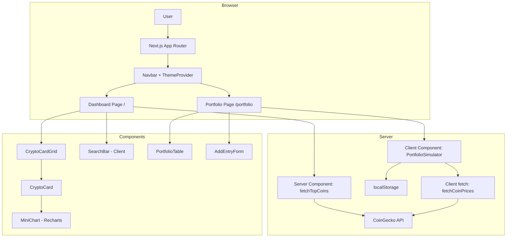

# Design Document — Crypto Tracker

## Overview

Crypto Tracker adalah aplikasi web Next.js 14 (App Router) yang menampilkan data pasar cryptocurrency secara real-time. Aplikasi ini terdiri dari dua halaman utama: **Dashboard** (top 20 crypto berdasarkan market cap) dan **Portfolio Simulator** (simulasi kepemilikan aset dengan kalkulasi P&L).

### Keputusan Desain Utama

| Keputusan | Pilihan | Alasan |
|---|---|---|
| Data fetching Dashboard | Server Component + `fetch` dengan `revalidate: 60` | SSR untuk SEO & performa awal, cache 60 detik mengurangi beban API |
| Data fetching Portfolio | Client Component + `useEffect` | Data portofolio bersifat per-user (localStorage), tidak bisa di-SSR |
| Dark mode | `next-themes` + Tailwind `dark:` variant | Integrasi native dengan shadcn/ui, mendukung OS preference & localStorage |
| Mini chart | Recharts `LineChart` tanpa axis/tooltip | Recharts sudah menjadi dependency, cukup untuk sparkline sederhana |
| State management | React `useState` + `useEffect` lokal | Tidak ada state global yang kompleks; localStorage cukup untuk persistensi |
| Search filtering | Client-side filter di Client Component | Data sudah di-fetch di server, filter cukup dilakukan di memori browser |

---

## Architecture



### Alur Data Dashboard

1. Request masuk ke `/` → Next.js merender `DashboardPage` sebagai Server Component
2. `fetchTopCoins()` memanggil CoinGecko API dengan `{ next: { revalidate: 60 } }`
3. Data dikembalikan ke Server Component → di-pass sebagai props ke `CryptoCardGrid`
4. `SearchBar` adalah Client Component yang menerima data awal dan melakukan filter di sisi klien
5. `MiniChart` menerima array `sparkline_in_7d.price` dari data CoinGecko

### Alur Data Portfolio

1. `PortfolioPage` adalah Client Component (karena bergantung pada localStorage)
2. Saat mount, membaca `portfolioEntries` dari localStorage
3. Mengambil harga terkini dari CoinGecko API via Route Handler `/api/prices`
4. Menghitung P&L dan menampilkan tabel

---

## Components and Interfaces

### Struktur Direktori

```
app/
├── layout.tsx                  # Root layout + ThemeProvider
├── page.tsx                    # Dashboard (Server Component)
├── portfolio/
│   └── page.tsx                # Portfolio (Client Component)
├── api/
│   └── prices/
│       └── route.ts            # Route Handler untuk fetch harga portfolio
components/
├── navbar.tsx                  # Navigasi utama + DarkModeToggle
├── theme-provider.tsx          # Wrapper next-themes
├── crypto-card.tsx             # Kartu satu aset kripto
├── crypto-card-grid.tsx        # Grid + SearchBar (Client Component)
├── mini-chart.tsx              # Recharts sparkline (Client Component)
├── portfolio-table.tsx         # Tabel portofolio
├── add-entry-form.tsx          # Form tambah entri portofolio
├── skeleton-card.tsx           # Skeleton loading
lib/
├── coingecko.ts                # Fungsi fetch CoinGecko API
├── portfolio.ts                # Logika kalkulasi P&L + localStorage helpers
└── types.ts                    # TypeScript interfaces
```

### Interface Komponen Utama

```typescript
// lib/types.ts

interface CoinMarket {
  id: string;
  symbol: string;
  name: string;
  image: string;
  current_price: number;
  price_change_percentage_24h: number;
  market_cap: number;
  sparkline_in_7d: {
    price: number[];
  };
}

interface PortfolioEntry {
  id: string;           // UUID, generated client-side
  coinId: string;       // CoinGecko coin ID (e.g., "bitcoin")
  coinName: string;
  coinSymbol: string;
  amount: number;       // Jumlah kepemilikan
  buyPrice: number;     // Harga beli per unit dalam USD
}

interface PortfolioEntryWithPnL extends PortfolioEntry {
  currentPrice: number;
  currentValue: number;
  pnlUsd: number;
  pnlPercent: number;
}
```

### Interface Fungsi Library

```typescript
// lib/coingecko.ts
async function fetchTopCoins(): Promise<CoinMarket[]>
async function fetchCoinPrices(coinIds: string[]): Promise<Record<string, number>>

// lib/portfolio.ts
function getPortfolioEntries(): PortfolioEntry[]
function savePortfolioEntries(entries: PortfolioEntry[]): void
function addPortfolioEntry(entry: Omit<PortfolioEntry, 'id'>): PortfolioEntry[]
function removePortfolioEntry(id: string): PortfolioEntry[]
function calculatePnL(entry: PortfolioEntry, currentPrice: number): PortfolioEntryWithPnL
```

### Props Komponen

```typescript
// components/crypto-card.tsx
interface CryptoCardProps {
  coin: CoinMarket;
}

// components/mini-chart.tsx
interface MiniChartProps {
  prices: number[];
  isPositive: boolean;
}

// components/crypto-card-grid.tsx
interface CryptoCardGridProps {
  coins: CoinMarket[];
}

// components/portfolio-table.tsx
interface PortfolioTableProps {
  entries: PortfolioEntryWithPnL[];
  onDelete: (id: string) => void;
}
```

---

## Data Models

### CoinGecko API — Endpoint yang Digunakan

**1. Top 20 Coins dengan Sparkline**
```
GET https://api.coingecko.com/api/v3/coins/markets
  ?vs_currency=usd
  &order=market_cap_desc
  &per_page=20
  &page=1
  &sparkline=true
  &price_change_percentage=24h
```

Parameter `sparkline=true` mengembalikan field `sparkline_in_7d.price` berisi array ~168 titik harga (per jam selama 7 hari). Endpoint ini tersedia di free tier CoinGecko tanpa API key.

**2. Harga Terkini untuk Portfolio**
```
GET https://api.coingecko.com/api/v3/simple/price
  ?ids={coinId1},{coinId2},...
  &vs_currencies=usd
```

Digunakan oleh Route Handler `/api/prices` untuk mengambil harga koin yang ada di portofolio pengguna.

### LocalStorage Schema

```typescript
// Key: "crypto-tracker-portfolio"
// Value: JSON.stringify(PortfolioEntry[])

// Contoh:
[
  {
    "id": "uuid-1234",
    "coinId": "bitcoin",
    "coinName": "Bitcoin",
    "coinSymbol": "BTC",
    "amount": 0.5,
    "buyPrice": 45000
  }
]
```

### Kalkulasi P&L

```
currentValue  = amount × currentPrice
pnlUsd        = currentValue − (amount × buyPrice)
pnlPercent    = ((currentPrice − buyPrice) / buyPrice) × 100
totalPortfolioValue = Σ currentValue untuk semua entri
```

### Dark Mode Storage

```
// Key: "theme" (dikelola oleh next-themes)
// Value: "light" | "dark" | "system"
```

---

## Correctness Properties

*A property is a characteristic or behavior that should hold true across all valid executions of a system — essentially, a formal statement about what the system should do. Properties serve as the bridge between human-readable specifications and machine-verifiable correctness guarantees.*


### Property 1: Warna perubahan harga 24 jam sesuai tanda nilai

*Untuk setiap* nilai `price_change_percentage_24h`, CryptoCard SHALL menerapkan warna hijau jika nilainya positif dan warna merah jika nilainya negatif.

**Validates: Requirements 1.3, 1.4**

---

### Property 2: CryptoCard menampilkan semua field yang diperlukan

*Untuk setiap* objek `CoinMarket` yang valid, komponen CryptoCard SHALL merender nama koin, simbol, harga saat ini dalam USD, dan persentase perubahan 24 jam.

**Validates: Requirements 1.2**

---

### Property 3: Warna MiniChart sesuai tren 7 hari

*Untuk setiap* array harga yang valid, MiniChart SHALL menggunakan warna hijau jika harga terakhir lebih tinggi dari harga pertama, dan warna merah jika harga terakhir lebih rendah dari harga pertama.

**Validates: Requirements 2.2, 2.3**

---

### Property 4: MiniChart tidak memiliki axis atau tooltip

*Untuk setiap* array harga yang valid, MiniChart SHALL dirender tanpa komponen XAxis, YAxis, CartesianGrid, maupun Tooltip.

**Validates: Requirements 2.4**

---

### Property 5: Filter search mengembalikan subset yang benar

*Untuk setiap* daftar koin dan setiap query pencarian, fungsi filter SHALL mengembalikan hanya koin yang nama atau simbolnya mengandung query tersebut (case-insensitive). Jika query kosong, semua koin dikembalikan.

**Validates: Requirements 3.2, 3.4**

---

### Property 6: Kalkulasi P&L akurat untuk semua nilai input

*Untuk setiap* kombinasi `amount`, `buyPrice`, dan `currentPrice` yang valid (positif), fungsi `calculatePnL` SHALL menghasilkan:
- `currentValue = amount × currentPrice`
- `pnlUsd = currentValue − (amount × buyPrice)`
- `pnlPercent = ((currentPrice − buyPrice) / buyPrice) × 100`

**Validates: Requirements 5.5**

---

### Property 7: Total portofolio adalah jumlah semua currentValue

*Untuk setiap* array `PortfolioEntryWithPnL`, total nilai portofolio SHALL sama dengan jumlah (sum) dari semua `currentValue` pada setiap entri.

**Validates: Requirements 5.6**

---

### Property 8: Portfolio entry localStorage round-trip

*Untuk setiap* array `PortfolioEntry` yang valid, menyimpan ke localStorage kemudian membaca kembali SHALL menghasilkan array yang identik (semua field sama).

**Validates: Requirements 5.2, 5.3**

---

### Property 9: Delete entry menghapus tepat satu entri

*Untuk setiap* array portofolio dan setiap `id` entri yang ada, memanggil `removePortfolioEntry(id)` SHALL menghasilkan array baru yang panjangnya berkurang 1 dan tidak mengandung entri dengan `id` tersebut, sementara semua entri lain tetap ada.

**Validates: Requirements 5.7**

---

### Property 10: Theme persistence round-trip

*Untuk setiap* nilai tema yang valid (`"light"` atau `"dark"`), menyimpan preferensi tema ke localStorage kemudian membacanya kembali SHALL menghasilkan nilai yang sama.

**Validates: Requirements 4.4**

---

## Error Handling

### CoinGecko API Errors

| Skenario | Penanganan |
|---|---|
| Network timeout / unreachable | `fetchTopCoins` melempar error; Next.js `error.tsx` menampilkan pesan error |
| Rate limit (429) | Retry tidak dilakukan; pesan error ditampilkan; cache 60 detik mengurangi frekuensi request |
| Partial data (field hilang) | TypeScript interface + optional chaining mencegah crash; nilai default ditampilkan |
| Portfolio price fetch gagal | State `priceError` ditampilkan di halaman Portfolio; entri tetap ditampilkan tanpa P&L |

### LocalStorage Errors

| Skenario | Penanganan |
|---|---|
| localStorage tidak tersedia | `try/catch` di semua localStorage helpers; pesan informatif ditampilkan (Req 5.8) |
| Data korup / invalid JSON | `try/catch` di `JSON.parse`; fallback ke array kosong |
| Storage quota exceeded | Error ditangkap; pengguna diberi tahu bahwa penyimpanan penuh |

### Implementasi Error Boundary

```typescript
// app/error.tsx — menangkap error dari Server Components
'use client'
export default function Error({ error, reset }) {
  return (
    <div>
      <p>Gagal memuat data: {error.message}</p>
      <button onClick={reset}>Coba lagi</button>
    </div>
  )
}

// lib/portfolio.ts — localStorage helper dengan error handling
function getPortfolioEntries(): PortfolioEntry[] {
  try {
    if (typeof window === 'undefined' || !window.localStorage) return []
    const raw = localStorage.getItem('crypto-tracker-portfolio')
    return raw ? JSON.parse(raw) : []
  } catch {
    return []
  }
}
```

---

## Testing Strategy

### Pendekatan Dual Testing

Strategi pengujian menggunakan dua lapisan yang saling melengkapi:

1. **Unit Tests** — menguji contoh spesifik, edge case, dan kondisi error
2. **Property-Based Tests** — menguji properti universal di seluruh ruang input

Library yang digunakan:
- **Vitest** — test runner
- **@testing-library/react** — rendering komponen
- **fast-check** — property-based testing (minimum 100 iterasi per property)

### Property-Based Tests

Setiap property test harus diberi tag komentar dengan format:
`// Feature: crypto-tracker, Property {N}: {property_text}`

| Property | Fungsi yang Diuji | Generator Input |
|---|---|---|
| Property 1 | `CryptoCard` render | `fc.float()` untuk price_change_percentage_24h |
| Property 2 | `CryptoCard` render | `fc.record({...})` untuk CoinMarket object |
| Property 3 | `MiniChart` render | `fc.array(fc.float({min: 0}), {minLength: 2})` |
| Property 4 | `MiniChart` render | `fc.array(fc.float({min: 0}), {minLength: 1})` |
| Property 5 | `filterCoins()` | `fc.array(CoinMarket)` + `fc.string()` |
| Property 6 | `calculatePnL()` | `fc.float({min: 0.001})` × 3 |
| Property 7 | `calculateTotalValue()` | `fc.array(PortfolioEntryWithPnL)` |
| Property 8 | `savePortfolioEntries()` + `getPortfolioEntries()` | `fc.array(PortfolioEntry)` |
| Property 9 | `removePortfolioEntry()` | `fc.array(PortfolioEntry, {minLength: 1})` |
| Property 10 | localStorage theme helpers | `fc.constantFrom("light", "dark")` |

### Unit Tests

Unit tests fokus pada:
- Skeleton loading ditampilkan saat data sedang diambil (Req 1.5)
- Pesan error ditampilkan saat API gagal (Req 1.6)
- SearchBar ada di halaman Dashboard (Req 3.1)
- Pesan "Tidak ada hasil" ditampilkan saat pencarian kosong (Req 3.3)
- Tombol toggle dark mode ada di Navbar (Req 4.1)
- ThemeProvider menggunakan `defaultTheme="system"` (Req 4.5)
- Halaman Portfolio dapat diakses (Req 5.1)
- Pesan error LocalStorage tidak tersedia (Req 5.8)
- Navbar selalu terlihat (Req 6.1)
- Link aktif ditandai secara visual (Req 6.3)

### Integration Tests

- `fetchTopCoins()` mengembalikan 20 item dengan field yang benar (Req 1.1)
- `fetchCoinPrices()` mengembalikan harga untuk coinIds yang diminta (Req 5.4)

### Smoke Tests

- Rute `/` dan `/portfolio` dapat diakses (Req 6.2)
- `DashboardPage` tidak memiliki `"use client"` directive (Req 7.1)
- `fetchTopCoins` menggunakan `{ next: { revalidate: 60 } }` (Req 7.2)
